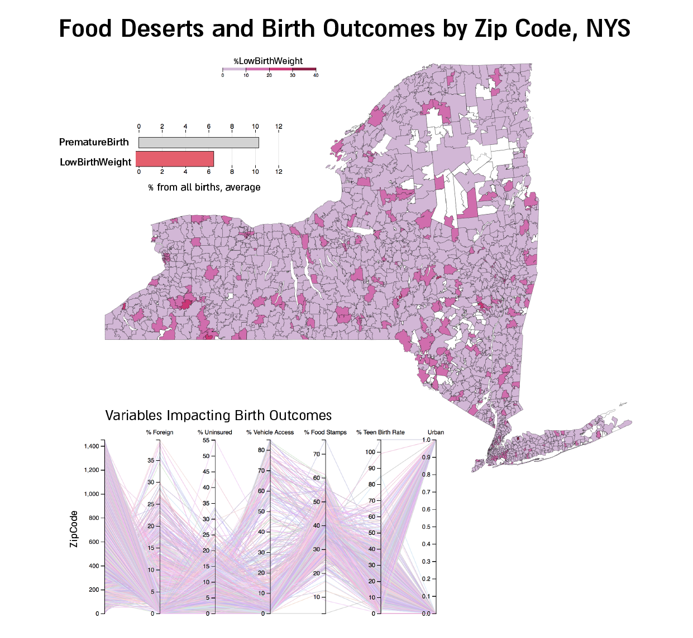
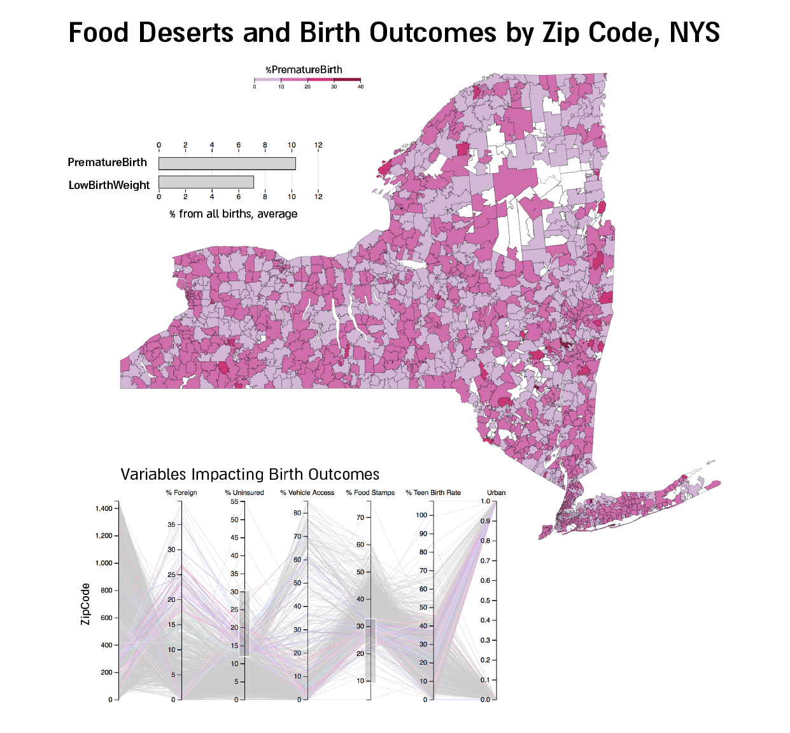

# Food Deserts and Birth Outcomes
#### Final Project for Data Visualization, NYU CUSP, Spring 2018
Prof. Huy Vo

### Group Members:
Dana Chermesh Reshef (dcr346@nyu.edu)
Emily Padvorac (ep2247@nyu.edu)

# Project Discription and Objective
This visualisation is an enhancement of an analysis that had been conducted as a part of Machine Learning for cities class, NYU CUSP Spring 2018. The research identified the important factors impacting low birthweight and preterm births for New York State on the zip code level, using random forests and Bayesian network approaches. This research seeks to understand to what extent living in a food desert may have on birth outcomes. In recent years, the topic of food deserts has become increasingly popular. In short, a food desert is an area that has low-access to healthy, nutritious food.

- _[Full report](https://github.com/danachermesh/Food_Deserts_ML/blob/master/FoodDesertBirthOutcomes_FinalPaper.pdf)_

The deliverable of this DataVis project is an interactive visualization that shows the share of the two negative birth outcomes out of total births for years 2012-2014 in New York State, analysed by zipcodes. The visualization also shows each zipcode's parameters that were found as impactful for predicting birth outcomes.

 
_**Fig.1 NYS zipcodes' negative birth outcomes**, interactive map + bar chart + parallel vis of predicting variables; The figure shows mousehover on one of the variables to update the map_

---

 
_**Fig.2 NYS zipcodes' negative birth outcomes**, interactive map + bar chart + parallel vis of predicting variables; The figure shows selections of ranges of variables in the parallel vis, the relevant zipcodes are highlighted_

----

# Data
## Data used for analysis:
_Data that were in used can be found in the [ML project GitHub repo under data folder](https://github.com/danachermesh/Food_Deserts_ML/tree/master/data)_

_Birth Outcome Variables Data_
Two adverse birth outcomes were considered: preterm birth and low birthweight. Data on these outcomes were collected from New York State Department of Health at the zip code level.

_Population Variables Data_
At the beginning of research, a dataset containing variables on food deserts was considered. However, the variables had extremely high multicollinearity. As such, data was gathered on a subset of the variables most relevant to the aim of the research. Data was collected and derived from the **American Community Survey (ACS) 5-year (2009-2016)** at the zip code level. Variables included: 
  - **Citizenship status** 
  - **Poverty rate** 
  - **Health insurance coverage** 
  - **Vehicle Access**
  - **SNAP (Food Stamp) Benefits**
  - **Urban / Rural**
A variable of **teen birth rate** was also considered, and was retrieved from the NYS Department of Health data. Additionally, each zip code was classified as either urban or rural, using classifications as defined by the US Census Bureau.

## Final datasets used for visualizations:

1. _NYS zipcodes shapefile_: 
https://raw.githubusercontent.com/OpenDataDE/State-zip-code-GeoJSON/master/ny_new_york_zip_codes_geo.min.json 

2. _Map+Chart visualization data_: https://raw.githubusercontent.com/danachermesh/Food_Deserts_ML/master/data/dataBirth1.json

3. _Parallel visualisation data_: https://raw.githubusercontent.com/ep2247/Data__Vis_FinalProject/master/FinalDataChart2.csv

# Visualization tools used
- D3.js, React
- Python pandas to clean and merge the origional datasets ([link to the Ipython notebook](https://github.com/danachermesh/Food_Deserts_ML/blob/master/FoodDeserts.BirthOutcomes_ML_analysis.ipynb))

# Visualization choices
- **Interactive Map of all zipcodes**: Map is the natural choice for viewing spatial data and interactions. The map colors each zipcode on the range of % of selected negative birth outcome from total births in that zipcode. The map is being updated according to mousehovering over the two birth outcomes analyzed. 
- **Bar chart to switch birth outcome zipcodes map**: The bar chart shows the average % of Premature birth and Low birth weight for all zipcodes in New York State. Hovering on each of the two birth outcomes will update the map to view the % for each zipcode, and will also update the legend of the map according to the choice.
- **Parallel Coordinate Chart of variables predicting Premature Birth and Low Birth Weight**: Parallel coordinates are used for analyzing multivariate data; this was the most appropriate way to efficiently view the relationships between the different demographic, social and spatial parameters were in use to build our ML model of predicting negative birth outcomes. Each line of the chart represents a zipcode; the line path is determined by the zipcode's characteristics of the variables analyzed. The chart is interactive and allows filtering the highlighted zipcodes according to the user's selection of one or more variables' range.

# Limitations of our visualization
The objective was to combine the two visualizations into one, as showed in _fig.1_ and _fig.2_, and to link the map to the parallel coordinates chart so when highlighting zipcodes in the parallel chart, the same zipcodes will be highlighted on the map as well and vise versa. Unfortunately, we were unable to do so; therefore, the two parts of our visualized data and results are shown here as two seperate visualizations. 

# How does the visualization help users
Identifying if certain variables are important in determining negative birth outcomes can help decide what policy levers to pull or what demographic groups to focus intervention programs on. These findings are applicable to New York government at both the state and local level, and would be most relevant to the Department of Health. The two visualizations highlight the different relationships between different demographic, social and spatial variables and their impact on negative birth outcomes, make these results and insights accessable to policy makers, as well as for non-professionals.

# Visualization + Code
The final deliverable is seperated to:

1. **Interactive Map + bar chart of Premature Birth and Low Birth Weight % by NYS zipcodes**: https://bl.ocks.org/ep2247/raw/1d5e937a9425e80170b81822f43207ea/
    - code to generate interactive map + bar chart (_use JSX (React)_): https://jsbin.com/ditukub/edit?js,output
2. **Parallel Coordinate Chart showing the variables used to predict Premature Birth and Low Birth Weight** (_see [birth.html](https://github.com/ep2247/Data__Vis_FinalProject/blob/master/birth.html) file in this repo): https://output.jsbin.com/lupohif
    - code to generate parallel visualization only: https://jsbin.com/lupohif/edit?js,output

